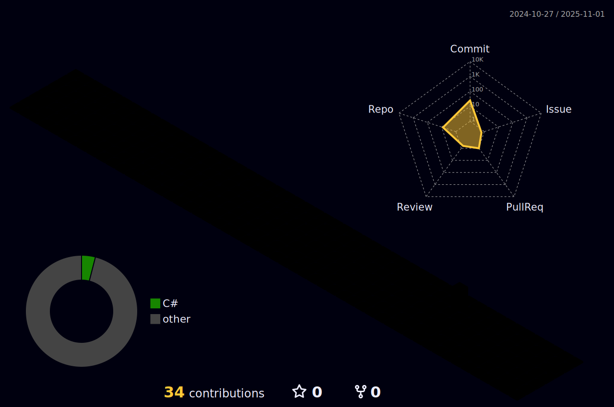

### Hello World! 
Eu sou o Matheus Alexandre! 👋🏻   
Atualmente sou desenvolvedor júnior de C#   
Tendo estudado continuamente .NET | SQL Server | Blazor | Razor | 

 
 
|  |  |  
|-----------------------------------------------------------------------------------------------------------------------------------------------------------------------------------------------------------------|----------------------------------------------------------------------------------------------------------------------------------------------------------------------------------------------------|
 
 
  

   
 
  

 
 
##
   

     
  

 

## Tecnologias no meu dia a dia

 
  
  
  
  
  

 

  
Meu LinkedIn 👇🏼
 

